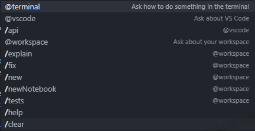
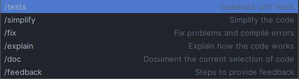
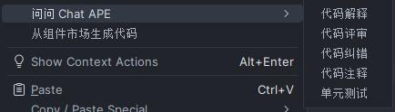

<h1 align="center">Github Copilot</h1>

## Chat工具介绍

VSCode & 微软家族开发工具

Android Studio & Jetbrains家族开发工具

详解：

| 命令                 | 解释                                                         | 备注    |            |
| -------------------- | ------------------------------------------------------------ | ------- | ---------- |
| @terminal            | Ask how to something in the terminal                         | @vscode |            |
| @vscode              | Ask about VS Code                                            | @vscode |            |
| /api                 | Ask about VS Code extension development                      | @vscode |            |
| @workspace           | Ask about your workspace(分析目录结构，代码结构，项目结构等) | @vscode | 不推荐使用 |
| /doc                 | 为此添加文档注释                                             |         |            |
| /explain             | Explain how the selected code works                          |         |            |
| /fix                 | Propose a fix for the problems in the selected code，优化代码，查找漏洞 |         |            |
| /new                 | Scaffold code for a new workspace                            | @vscode | 不推荐使用 |
| /newNotebook         | Create a new Jupyter Notebook                                | @vscode |            |
| /tests               | Generate unit tests for the selected code                    |         |            |
| /help                | 获取使用帮助                                                 | @vscode |            |
| /clear               | 清理聊天窗口消息                                             | @vscode |            |
| /feedback            | Steps to provide feddback                                    |         |            |
| #editor              | The visible source code in the active editor                 | @vscode |            |
| #selection           | The current selection in the active editor                   | @vscode |            |
| #file                | 调用打开搜索文件的弹窗                                       | @vscode |            |
| #terminalLastCommand | The active terminal's last run command                       | @vscode |            |
| #terminalSelection   | The active terminal's selection                              | @vscode |            |

## 能做什么

### APE

## AI 碾压人类的10个编程场景 AI=100xH

- 正则表达式编写
- 编写测试代码，包含类边界条件验证
- 使用难以记忆关键字编写代码，比如：HTML/CSS编写
- 编写不熟悉的复杂算法
- 使用、学习不熟悉的编程语言
- 按常识完善对象字段
- 示例、测试数据生成
- 复杂参数填写和上下文匹配
- 理解复杂代码并编写文档，评审代码，提出改进意见
- 自动编写单元测试，一次性提高代码测试覆盖率

### 其他补充

- 代码补全
- 代码转注释
- 代码转文档
- 注释转代码
- 语言翻译（Java -> Kotlin，Java -> Python）
- 结构化数据生成对象
- 导入markdown文件生成代码
- 生成markdown文档，mermind语法，latex语法等
- 辅助Jupyter Notebook编写分析文档

## 实例

### 读取markdown文档生成代码

VSCode。

根据 #file:demo.md 内容生成代码

根据 #file:Json.md 内容生成实体类并生成get set方法

注：Json格式文件无法读取，需要转成markdown

### 根据文件解释方法代码

- 在chat中选中文件，然后输入：/explain 解释一下getScale方法含义

### 解释选中代码方法

- 选中代码，右键Explain This
- 选中代码，Chat输入：/explain，回车，或者后面添加：请使用中文

### 生成选中方法的文档

- 选中代码，右键Generate Doc
- 选中代码，Chat输入/doc， 回车（需要英文后面加上`中文`即可）

### 生成测试用例

- 选中代码，右键Generate Tests
- 选中代码，Chat中输入/tests，回车

### 修复或者优化代码

- 选中代码，右键Fix This
- 选中代码，Chat中输入/fix，回车（或者加上提示，优化代码）

### 备选方案或者其他方案

- 选中代码，输入：对于选中代码，是否还有更好的方案

### 创建Jupyter Notebook文件

1. 输入：创建一个jupyter Notebook文件
2. 给出提示，按照提示创建文件
3. 输入：导入#file:diabetes.csv 数据，生成代码，放到Notebook中，如果没有安装依赖，右键可以修复
4. 然后逐步输入需求，让其生成对应的代码，并运行，
5. 输入评估模型结果，然后输入：根据上述分析请给出分析结论
6. 输入：如果你是一个高级数据分析工程师，请给出优化该模型的建议

## 文档

- [在 IDE 中使用 GitHub Copilot Chat - GitHub 文档](https://docs.github.com/zh/copilot/github-copilot-chat/using-github-copilot-chat-in-your-ide)